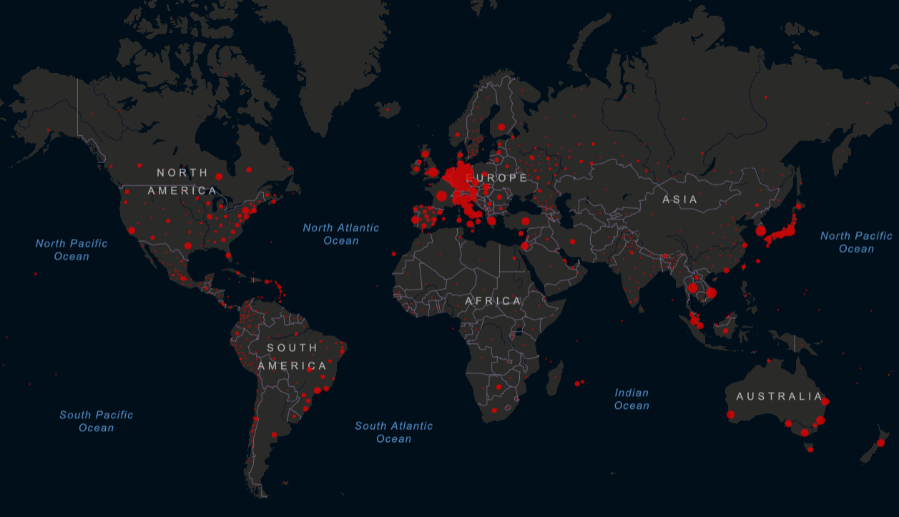

```{r setup, include=FALSE}
knitr::opts_chunk$set(echo = TRUE)
```

<center>


**Análisis de Biología Computacional**

BT1013.324  
Evidencia 1 | Análisis inicial  
Equipo 2
**Profesores: **  
Dra Laura Gómez  
Dr. Hugo Tovar  
Febrero – Junio  
Fecha de entrega: 26/04/2022  
</center>

**1. ¿Cuál es la situación actuals de COVID-19 a nivel mundial, en México, en tu estado de origen y en tu municipio, alcaldía o colonia? **
Gracias a la aplicación de las diferentes vacunas, el SARS COV 2 ha bajado su nivel de alarma en el mundo. A pesar de esta evidente mejora, los contagios siguen aún sin detenerse. Un claro ejemplo es el continente Europeo, el cual sigue manteniéndose como el continente con más casos reportados al día de hoy y de igual forma Estados Unidos como uno de los países con mayor número de contagios.  
  
Enfocándonos en la situación actual de nuestro país y gracias a los datos obtenidos en los últimos 14 días por el gobierno Mexicano, podemos observar la mejoría en la situación ante la pandemia por COVID-19, teniendo solamente 11,806 nuevos casos reportados en todo el país.  
Por su parte la Ciudad de México, al ser uno de los estados con mayor número de habitantes también se mantiene como el segundo estado de la república con el mayor número de contagios en los últimos 14 días, pero manteniendo un margen de aproximadamente 200 casos por día.  
En cuanto a la distribución de contagios por alcaldía, podemos ver que tanto la alcaldía Iztapalapa y la alcaldía Tlalpan poseen el mayor número de casos reportados tanto de contagios como de muertes. A pesar de todo esto, se puede concluir que la tendencia actual de la pandemia se encuentra en decrecimiento.

**2. ¿Cuál fue la primera variante del virus que se propagó a todo el mundo?**
La variante de SARS-CoV-2 B. 1.1.7, también conocida como variante alfa, fue identificada por primera vez en Reino Unido en septiembre del 2020. Para el mes de Diciembre aumentaron las infecciones por esta variante, poco después se vieron más casos alrededor del mundo. En enero de 2021, en Estados Unidos se estableció como la variante más predominante. La variante alfa porta una mutación en la proteína S que afecta la conformación del dominio de unión al receptor, posee una mutación la cual es la eliminación en las posiciones 69 y 70, la cual le da la carácter de mayor transmisibilidad. Esta variante perdió relevancia con el surgimiento de la variante Delta, la cual era más agresiva. {Galloway, 2021}

**3. ¿Cuáles son las otras variantes del virus que existen en otras regiones del mundo?**
Una variante es un genoma viral que puede tener una o más mutaciones. Para la organización mundial de la salud, las variantes se pueden clasificar también por su linaje. De acuerdo con el SARS-CoV-2 Interagency Group (SIG) de Estados Unidos, existen las siguientes variantes que están monitoreando {CDC, 2020}: 

Alpha (B.1.1.7 y linajes Q)
Beta (B.1.351 y linajes descendientes)
Gamma (P.1 y linajes descendientes)
Epsilon (B.1.427 y B.1.429)
Eta (B.1.525)
Iota (B.1.526)
Kappa (B.1.617.1)
Mu (B.1.621, B.1.621.1)
Zeta (P.2)

**4. ¿Cómo buscarías información de la variante del virus en tu país?**
Las fuentes de información primarias tendrían que ser las puestas a disposición para la población en general por el gobierno federal. Un primer abordaje debería realizarse a través de algún portal o medio perteneciente a alguna dependencia gubernamental oficial. Para este caso, lo más indicado parece ser revisar el “Reporte de vigilancia genómica del virus SARS-CoV-2 en México”. Dicho informe se realiza a una fecha determinada y se actualiza periódicamente. Cuenta con el respaldo de la Dirección General de Epidemiología, el Instituto de Diagnóstico y Referencia Epidemiológicos, y de la Unidad de Desarrollo Tecnológico e Investigación Molecular. En él se puede encontrar información general acerca de las distintas variantes que existen en el país, linajes de algunas variantes y la distribución de estos por entidad federativa y región. Otra fuente considerada como oficial es consultar los datos publicados por la ONU para el caso de nuestro país. En su portal se pueden encontrar noticias, recursos y datos actualizados acerca del desarrollo de la pandemia en México y el mundo. Así mismo deben considerarse como fuentes relevantes a la hora de hablar de variantes, los distintos proyectos promovidos por alianzas en todo el mundo con el objetivo de cooperar por la salud pública global. Bases de datos como GISAID entran en esta categoría. 

**5. Imagina que te encuentras en una situación similar a la de Li Wenliang, médico chino que intentó alertar sobre el brote de coronavirus en su país, pero fue detenido por las autoridades y obligado a retractarse, ¿qué harías en su caso? Selecciona un inciso y justifica tu elección: a) Lo reportas al centro de investigación o la universidad. b) Lo reportas a la prensa. c) Guardas la información. Elige y justifica tu respuesta. Revisa el siguiente video como apoyo:?**

a) Lo reportas a la prensa. 

En el caso de tener información de un virus altamente contagioso, considero que la mejor opción es contactar a  la prensa cómo lo hizo el Doctor Li Wneliang. En mi opinión creo que aunque vivimos en un mundo altamente globalizado, dónde enormes cantidades de información fluyen cada segundo alrededor de todo el mundo, lo que hace que las posibilidades e incluso los intentos por ocultar información sean cada vez más difícil(riesgosos), no se tiene que dejar de lado la posibilidad de que grandes organizaciones o instituciones con poder quieran privar la capacidad que tiene un agente menos poderoso a  comunicar algo que puede ser de suma relevancia en el mundo moderno, por lo cuál lo apropiado sería difundirlo a todos los lados dónde sea posible y relevante, en la prensa, mandarlo a instituciones o centros de investigación tanto nacionales como internacionales, gobiernos, etc. En un mundo donde el internet y las redes sociales nos mantienen al tanto de lo que pasa globalmente en todo momento, es muy fácil compartir información a través de esta. Sin embargo, su viralización y/o propagación puede ser baja, por ello la prensa brinda más acceso a través de sus espectadores y medios de comunicación conocidos para que la información se vuelva viral gracias a sus herramientas de trabajo. La prensa es un medio de comunicación a la que mucha gente recurre y con información respecto a un posible virus mortal, la población podría estar  informada y podrían tomar precauciones .

```{r, include = FALSE}
# Agrega el working directory
setwd("/Users/aram/R/EVIDENCIA 1")
```

**1. Obtén las secuencias de las variantes de SARS-CoV-2 desde el NCBI o el buscador de virus del NCBI.**
```{r}
# Utiliza el paquete seqinr
library(seqinr)
variants <- c(
  alpha = read.fasta("./fasta/alpha.fasta"),
  beta = read.fasta("./fasta/beta.fasta"),
  epsilon = read.fasta("./fasta/epsilon.fasta"),
  eta = read.fasta("./fasta/eta.fasta"),
  gamma = read.fasta("./fasta/gamma.fasta"),
  iota = read.fasta("./fasta/iota.fasta"),
  kappa = read.fasta("./fasta/kappa.fasta"),
  mu = read.fasta("./fasta/mu.fasta"),
  omicron = read.fasta("./fasta/omicron.fasta"),
  zeta = read.fasta("./fasta/zeta.fasta")
  )
names(variants) <- c("alpha", "beta", "epsilon", "eta", "gamma", "iota", "kappa", "mu", "omicron", "zeta")
```
**2. Calcula la longitud de las secuencias de cada variante.**
```{r}
lengthVars <- c()
for(i in names(variants)){
  lengthVars[i] <- length(variants[i][[1]])
  rm(i)
}
names(lengthVars) <- names(variants)
lengthVars
```
**3. Crea una gráfica donde compares las bases de ADN que componen a cada una de las variantes del virus.**
```{r}
bases <- function(chains){
  comps <- lapply(chains, table)
  b <- c()
  for(el in comps){
    b <- c(b,as.numeric(el))
  }
  return(list(
    a = b[seq(from = 1, to = length(b), by = 4)],
    c = b[seq(from = 2, to = length(b), by = 4)],
    g = b[seq(from = 3, to = length(b), by = 4)],
    t = b[seq(from = 4, to = length(b), by = 4)]
  ))
}
B <- bases(variants)
colors <- c("pink", "blue", "purple", "cyan", "magenta", "gray", "red", "black", "green", "orange")
par(mar = c(5,4,4,8), xpd = T)
barplot(matrix(c(B$a, B$c, B$g, B$t), nrow = 10), beside = TRUE, col = colors, las =2, names.arg = c("A", "C", "G", "T"), ylab = "Frecuencia", xlab = "Bases")
legend("topright",legend = names(variants) , col = colors,  pt.cex = 1, pch = 15 , cex = 1, inset = c(-0.2,0))
rm(colors)
```
**4. ¿Cuál es el %GC de cada variante?**
```{r}
GCperc <- c()
for(i in names(variants)){
  GCperc <- c(GCperc, GC(variants[i][[1]]))
}
rm(i)
names(GCperc) <- names(variants)
GCperc
```

**5. Crea las secuencias contrasentido de cada variante.**
```{r}
inv <- function(chain){
  return(chain[length(chain):1])
}
contra <- lapply(variants, inv)
names(contra) <- names(variants)
contra
```

**6. Agrega una interpretación escrita de las gráficas que integras.**


La gráfica que integra la cantidad de bases nitrogenadas que componen a cada variante del virus SARS-CoV-2 arroja resultados bastante interesantes. En primer lugar, se observa una clara similitud en la composición de bases a través de todas las variantes, es decir, se ve poca o nula variación entre variantes. Esto arroja una pregunta simple pero que invita a la reflexión: ¿Por qué si la composición de bases es prácticamente la misma, las variantes adquieren diferentes características y se comportan de manera diferente? Bueno pues si se tiene un conocimiento básico del dogma central de la biología molecular, esto queda respondido, ya que no importa en si la composición de bases nitrogenadas, sino más bien el cómo están acomodadas dichas bases. En un organismo biológico, ya sea desde un humano hasta un virus, lo que últimamente dicta qué características tendrá un organismo serán las proteínas, y estas proteínas están definidas mediante el orden de las bases nitrogenadas que tiene un codón en un gen. Y esta reflexión busca recalcar la perfección de la naturaleza que orquesta secuencias de miles de bases que no son más que instrucciones para crear proteínas y aunque las bases sean las mismas, el orden y en última instancia, el producto final(las proteínas) es lo realmente importante. Una simple secuencia de aminoácidos puede determinar si un virus es altamente letal o es inofensivo, de la misma manera, los humanos comparten cerca del 60 por ciento de su ADN con los plátanos, pero claramente por solo cambiar el orden de las bases, se observan diferencias diametralmente opuestas entre dichos organismos, solo con células produciendo diferentes proteínas.


**Datos Personales**

José Aram Méndez Gómez A01657142


**Referencias:**

-Banco Interamericano de Desarrollo. (n.d.). Situación actual de la pandemia | IADB. Www.iadb.org. Retrieved April 24, 2022, from https://www.iadb.org/es/coronavirus/current-situation-pandemic 

-CDC. (2020, February 11). Coronavirus Disease 2019 (COVID-19). Centers for Disease Control and Prevention. https://www.cdc.gov/coronavirus/2019-ncov/variants/variant-classifications.html 
-Dirección General de Epidemiología. (2022, April 21). COVID-19 Tablero CDMX. Geoint COVID - 19 Tablero CDMX. https://cdmx.dash.covid19.geoint.mx/ 

-Galloway, S. E., Paul, P., MacCannell, D. R., Johansson, M. A., Brooks, J. T., MacNeil, A., Slayton, R. B., Tong, S., Silk, B. J., Armstrong, G. L., Biggerstaff, M., & Dugan, V. G. (2021). Emergence of SARS-CoV-2 B.1.1.7 Lineage - United States, December 29, 2020-January 12, 2021. MMWR. Morbidity and mortality weekly report, 70(3), 95–99. https://doi.org/10.15585/mmwr.mm7003e2

-John Hopkins University. (2021). Johns Hopkins Coronavirus Resource Center. Johns Hopkins Coronavirus Resource Center; Johns Hopkins University & Medicine. https://coronavirus.jhu.edu/map.html 

-OMS. (n.d.). Seguimiento de las variantes del SARS-CoV-2. Www.who.int. https://www.who.int/es/activities/tracking-SARS-CoV-2-variants 

-Universidad Johns Hopkins, Our World in Data, & Google COVID-19 Community Mobility Reports. (n.d.). Coronavirus (COVID-19) - Google Noticias. Google Noticias. Retrieved April 24, 2022, from https://news.google.com/covid19/map?hl=es-419&mid=%2Fm%2F04sqj&gl=US&ceid=US%3Aes-419 


